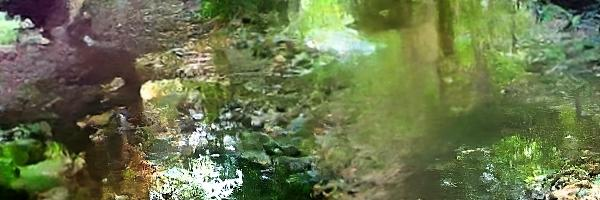
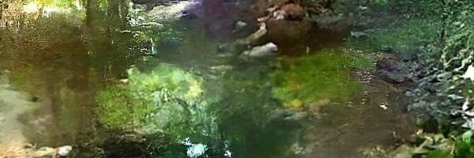
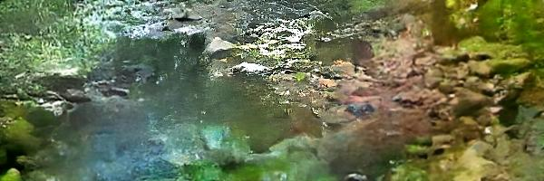

# CT DEEP Rivers Diffusion Augmentation

## Overview

This research project aims to improve image classification accuracy for CT river images by using diffusion models to artificially augment the dataset. This approach ensures a balanced dataset, which is often it's not the case in environmental image datasets, and exposes the classification model to more image diversity, leading to better generalization. Since the problem we are focused on is the two-category problem, category 1: labels 1,2,3, and category 2: 4,5,6, we will want to train 3 diffusion for each label in category 1. 



This repository contains a pipeline with 3 main components, and it's designed to be run in the respective sequential order:
1. `site_id_balancer.py`, creates a new dataset named `diffusion_data` by  augmenting the original dataset with traditional augmentations (e.g., rotations and horizontal flips). This new dataset will be used to train the diffusion model to ensure no `site_id` bias during inference
2. The diffusion model itself includes `run_diffusion.py`, `diffusion_model.py`, `u_net_backbone.py`, `config.py`, `utils.py`, and `train_all.py.` These scripts are the main components used to train the model and perform inference. 
3. `diffusion_augmentation.py` which uses pre-trained diffusion models (after running `train_all.py`) to perform reverse diffusion to augment the final dataset to be used to train the image classifier

## Tensorflow and Keras Dependencies

This code works with Keras 3.6.0, and Tensorflow 2.16.1 and 2.17.0. Other versions, might conflict, especially Keras 3.7.0 requiring the model to be "explicitly built." This issue will be fixed in a future iteration. 

## CT DEEP Rivers Site ID Balancer (for Diffusion Models)

This script balances and performs the necessary image augmentations (e.g., 5-degree rotations + horizontal flips) on river stream images from CT DEEP, to prepare the dataset for diffusion model training. Since the dataset is unbalanced, training it directly (without augmentation) may cause the diffusion model to generate more images from certain site IDs. To compensate for this, we augment the dataset, ensuring a balanced distribution for training. The default augmentation process includes:
- **Rotations**: Every 5 degrees, from 5 to 30 degrees.
- **Horizontal flip**: Applied before moving to the next degree of rotation.

The script augments all images from each `site_id` folder until the number of images matches the folder with the maximum number of images. If there are not enough unique augmentations to match the maximum number of images, the process will stop after running out of available augmentations. This ensures that all `site_ids` are adequately represented in the dataset.

### > How to Use

The script takes several input arguments:

- **in_dir**: (required) The directory containing labeled folders (e.g., `1`, `2`, ... `6`).
- **out_dir** (optional): The directory where augmented images will be saved. If not provided, the augmented images will be saved in the current working directory. The **out_dir** will be structured like this: "diffusion_data/flow_1/1" and so on, which is done to make it easier to fetch when training it on the diffusion model.
- **labels** (default = 3): The number of labels (site IDs) to balance and augment. For example:
  - If `labels=3`, the script will augment labels `1`, `2`, and `3`.
  - If `labels=6`, the script will augment labels `1` through `6`.
- **theta** (default = 5): The angle of rotation in degrees. If you change `theta`, you should also adjust the `fact` parameter to ensure the image is properly cropped after rotation. The default setting of 5-degree intervals requires a `fact` of 1.3x to account for the padding caused by rotation.
- **fact** (default = 1.3): The zoom factor applied after rotation to crop out any black padding that may result from the image rotation.
- **multiplier** (default = 6): The number of rotations to apply. If `multiplier=6`, the image will be rotated from 5 to 30 degrees, with horizontal flips in between, resulting in a final multiplier of 13x for each image.

#### Example Usage (using default values)
```bash
python3 site_id_balancer.py --in_dir flow_600_200
```

## CT DEEP Rivers Diffusion Model

The model is a Denoising Diffusion Implicit Diffusion Model (with a 50% stochastic process), built on a U-Net backbone, implemented in Tensorflow/Keras. The scripts encompassing the diffusion model are `run_diffusion.py`, `diffusion_model.py`, `u_net_backbone.py`, `config.py`, `utils.py`, and `train_all.py.` 



### > Hyperparameters descriptions 

#### General Parameters
- `--in_dir` (str): Directory containing labeled river images (e.g., L1/1/image.JPG).
- `--out_dir` (str): Directory to save model weights, callbacks, and results.

#### Training Parameters
- `--runtime` (str): Run mode, choices are "training", "inference", or "inpainting".
- `--load_and_train` (bool): Flag to load a pre-trained model for further training.
- `--eta` (float): Eta parameter for noise scheduling.
- `--image_size` (tuple): Size of the input images (height, width).

#### Optimization (Training) Parameters
- `--num_epochs` (int): Number of training epochs.
- `--batch_size` (int): Batch size for training.
- `--learning_rate` (float): Learning rate for optimization.
- `--use_mix_precision` (bool): A flag whether to use mixed precision training.
- `--gpu_index` (int): Index of the GPU to use.

#### U-Net Architecture Parameters
- `--embedding_dims` (int): Number of embedding dimensions.
- `--widths` (list of int): Widths for each convolutional layer.
- `--block_depth` (int): Depth of the U-Net blocks.
- `--attention_in_bottleneck` (bool): A flag to use attention mechanism in the bottleneck.
- `--attention_in_up_down_sample` (bool): A flag to use attention in up/down sampling layers.

#### Inference Parameters
- `--model_dir` (str): Directory where the model weights are located.
- `--images_to_generate` (int): Number of images to generate during inference.
- `--generate_diffusion_steps` (int): Number of diffusion steps for generation.

### > Configuring Hyperparameters for the Diffusion Model

1. **Modify `config.py` Directly -** Manually modify hyperparameters in `config.py` This provides full control over all available settings.
   
2. **Use `argparse` to Pass Arguments -** To keep this `README.md` concise, please refer to `utils.py` in `ParseArgs()` for a full list of input arguments. **Note:** Not all hyperparameters are available via argparse. If you need to modify hyperparameters not found in `ParseArgs()`, you need to update the `config.py` directly.

### > Architectural Tips
1. Set `attention_in_bottleneck` to **True** because it significantly improves performance
2. Set `embedding_dims` to the last width in `widths`. For example, if your `widths` is [64, 128, 256, 516], set the `embedding_dims` to 516. In my experience, it improves the perceptual quality
3. For `block_depth` a good number is 3-4
4. I have tried `widths` of **[64, 128, 256, 516]**, **[64, 94, 128, 256]**, **[32, 64, 96 128]**. If you noticed that you set the `widths` to be really high like **[64, 128, 256, 516]**, and the image quality is off, it just means that it has not fully converged. For **[32, 64, 96 128]** it easily converged with 100 epochs but failed in reproducing good context with label 3 images. 


### > How to Use (Training & Inference)

For single model training and inference, use `run_diffusion.py.`

#### Training the Model (using `config.py`)

1. Set `runtime = "training"` in the `config.py`.
2. Set `in_dir` to the dataset directory, including the label (e.g., `diffusion_data/L2`).
3. Modify other important training parameters like `num_epochs`, `batch_size`, or `learning_rate`.
4. Run the following command in the terminal:  

    ```
    python3 run_diffusion.py 
    ```

#### Training the Model (using `argparse`)

1. Configure `argparse` arguments like below:

    ```
    python3 run_diffusion.py --in_dir diffusion_data/L2 --gpu_index 0 --use_mix_precision --num_epochs 200 --learning_rate 1e-5 --batch_size 8 --attention_in_bottleneck --widths 64 128 256 516 --embedding_dims 516 --block_depth 3
    ```

#### Perform Inference (using `config.py`):

1. Train a diffusion model until convergence. 
2. Modify `model_dir` to the folder where the weight is located, e.g., `"results/L2_2025-01-12_14:55:51"`. If you provide the correct model directory, it will automatically remember the configurations used.
3. Modify other important hyperparameters such as `images_to_generate` and `generate_diffusion_steps`, and then run the following command: 

    ```
    python3 run_diffusion.py
    ```

#### Perform Inference (using `argparse`):

1. Set `--runtime inference` and provide the directory of the model's weights `--model_dir` like this:   

    ```
    python3 run_diffusion.py --runtime inference --model_dir results/L2_2025-01-12_14:55:51 --images_to_generate 5 --generate_diffusion_steps 50 --eta 1
    ```

### > Train Multiple Diffusion Models

Since our final goal is to train 3 diffusion models (one for each label), we will be using  `train_all.py` primarily. `train_all.py` serves as a training loop for `run_diffusion.py`. It uses argparse to parse all of the arguments requested to run `run_diffusion.py` (it shares the same argparse arguments). `train_all.py` will require you to provide `--in_dir`, which is the location of your dataset. If you used `site_id_balancer.py` then the `in_dir` path is simply: `pwd/diffusion_data`.

Similar to running a single model, you can change hyperparameters by directly modifying the `config.py` or using argparse arguments when calling `train_all.py`. **Note:** If you're using `train_all.py`, the `config.py` file copied to the output directory will not reflect the parameters you used (because it does not update from argparse). Instead, focus on the `config_parameters.txt` file.

#### How to Use `run_training_loop.py`

##### If you want to use default parameters:  

```
python3 train_all.py --in_dir diffusion_data
```

##### If you want to pass different hyperparameters: 

```
python3 train_all.py --in_dir diffusion_data --gpu_index 0 --use_mix_precision --num_epochs 200 --learning_rate 1e-5 --batch_size 8 --attention_in_bottleneck --widths 64 128 256 516 --embedding_dims 516 --block_depth 3
```

## CT DEEP Rivers Diffusion Augmentation for Image Classification

This script balances and performs the necessary image augmentations (e.g. reverse diffusions from a pre-trained diffusion model) on river stream images from CT DEEP. It prepares the dataset for image classification training, focusing on a two-category problem: labels 1, 2, 3 vs labels 4, 5, 6. The script augments the category with the least amount of images. After determining which category has fewer images, it augments more for the labels with fewer images. Within each label, it further augments the `site_ids` with the least number of images.

### How to Use

- **`in_dir` (required)**: Directory containing the original dataset with labeled folders (e.g. 1, 2, ... 6).
- **`weight_paths` (required)**: Path to the pre-trained diffusion model weights.
- **`out_dir` (optional)**: Directory to save the balanced data (default: `balanced_data` in the current working directory).
- **`generate_diffusion_steps` (optional)**: Number of diffusion steps for augmentation (default: 50).

#### Example

```bash
python3 diffusion_augmentation.py --in_dir flow_200_600 --weight_paths results/L1_date results/L2_date results/L3_date
```

